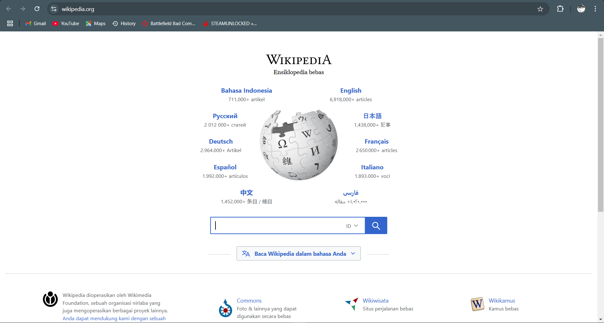

# Proyek Asisten Suara Python

Asisten suara sederhana yang dibangun menggunakan Python. Asisten ini dapat mendengarkan perintah suara dan melakukan berbagai tindakan seperti menyapa, membuka situs web, memutar musik, memberi tahu waktu, dan menutup program.

## Fitur

- **Perintah Suara**: Asisten mendengarkan perintah melalui mikrofon dan merespons suara. "Hello"
- **Teks-ke-Suara**: Asisten memberikan respons suara menggunakan pustaka pyttsx3.
- **Play Music**: Asisten dapat mencari lagu di YouTube berdasarkan nama yang disebutkan.

  
  
- **Time**: Asisten dapat memberi tahu waktu saat ini.
- **Open Website**: Asisten dapat membuka situs web yang disebutkan.
- 
 

- **Close**: Anda dapat menghentikan asisten dan keluar dari program dengan perintah suara "Thanks for helping.

## Prasyarat

Untuk menggunakan proyek ini, Anda perlu menginstal Python di sistem Anda beserta pustaka yang dibutuhkan.

### Instalasi Dependensi Python

Instal pustaka yang dibutuhkan dengan menjalankan perintah berikut:

```bash
pip install SpeechRecognition pyttsx3 pyaudio
